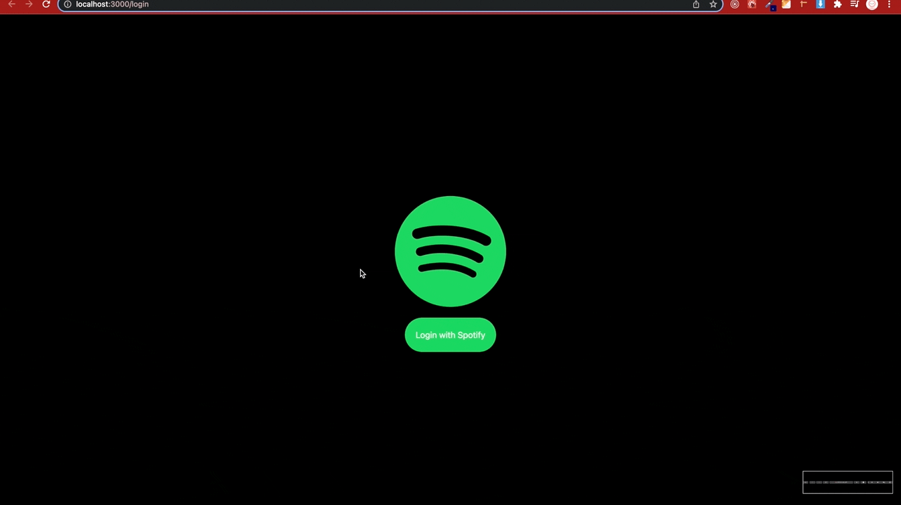
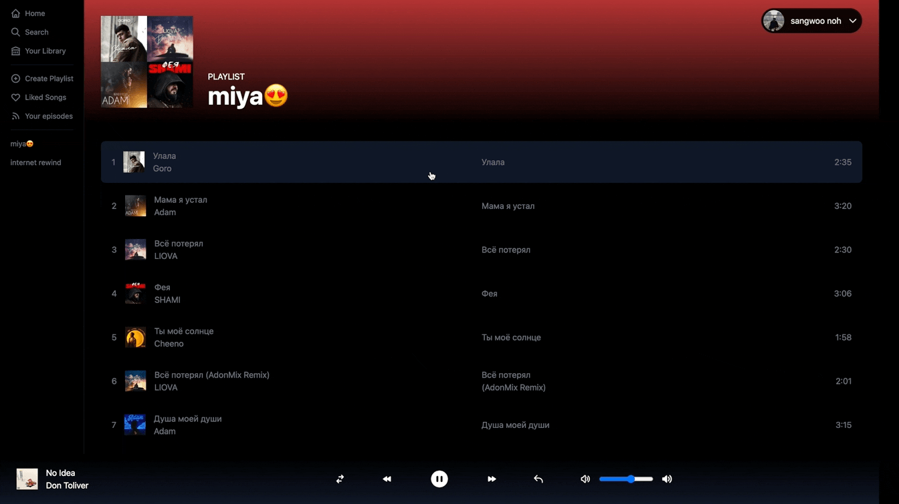

# Spotify clone

## stack

- tailwindcss, nextjs, recoil, spotifyAPI, lodash,

## usage

- spotify player에 의존할수밖에 없게 만들었다.

0. spotify 공식홈페이지(web)에서 본인 계정아이디 로그인후 아무 음악이나 play한다(spotify 전용 player detect를 위하여 꼭 spotify공식 player를 한번 활성화 시키고 일시정지를 해놓은 상태에서 본 프로젝트를 사용해야한다) 
1. 그다음 본 spotify clone페이지로 돌아와서 사용하면 된다.

## 주요기능

- playlist불러오기, 사용자 정보 불러오기, 로그인기능, 노래 재생,
  볼륨 컨트롤, 노래 일시정지
- 토이프로젝트라서 이정도 선에서 마무리하고 고도화 예정 없음.

## 시연 영상

- Login


<br/><hr/>
- 기능 동작


<br/><hr/>
- Logout



## nextjs-examples

create-next-app -e samplename

## heroicons(tailwindcss icons)

- ref: https://heroicons.com/

## next auth

로그인 인증을 위한 basic code form

- login 과 logout기능을 관리해준다(세션에 토큰저장하는 방식으로 처리)

- ref: https://next-auth.js.org/

## spotify web api noe

- ref: https://github.com/thelinmichael/spotify-web-api-node

```
$ npm install spotify-web-api-node
```

- spotify developer에서 api를 생성후 edit settings
  Redirect URIs에 아래 도메인을 추가해준다(화이트리스트에 추가해주는 내용)
  http://localhost:3000/api/auth/callback/spotify
  http://localhost:3000

## recoil

global state managing tool

- ref: https://recoiljs.org/ko/
  npm install recoil

## issue1

token이 만료됐을때 로그아웃처리 및 세션초기화가 안됨 (에러핸들링 해야함)

\_app에서 context 관련내용으로 해결

## tailwindcss-hide-bar

- tailwindcss scrollbar hide 모듈을 설치해서
  className="scrollbar-hide"로 적용하면 작동함

- ref: https://www.npmjs.com/package/tailwind-scrollbar-hide

## 글자의 길이가 너무 길때 생략해주는 tailwindcss

- truncate

## tailwindcss custom

\_app.tsx에 globals.css로 불러오고 custom 하고싶은내용을 그곳에 수정한다.
